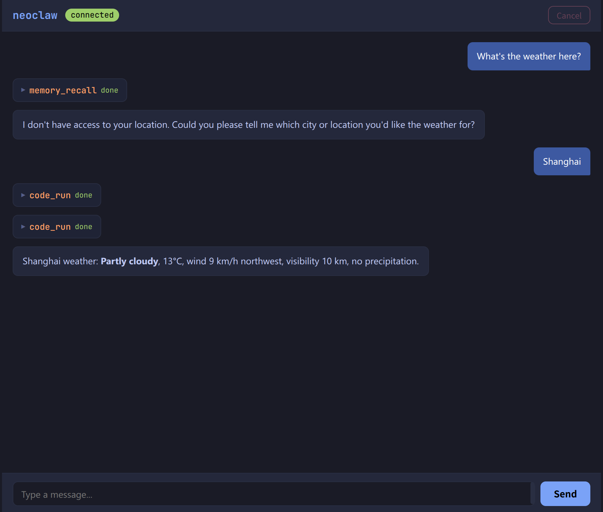

<h1 align="center">Neoclaw</h1>

<p align="center">
  Claw ライクなエージェントシステムを、別の設計思想で実装したプロジェクトです。
</p>

<p align="center">
  
  
  
  
</p>

<p align="center">
  
</p>

<p align="center">
  <a href="README.md">English</a> | <a href="README.zh-CN.md">简体中文</a> | <a href="README.ja.md">日本語</a>
</p>

> 🚧 **Neoclaw はまだ初期開発段階です。**
>
> 機能要望や設計に関する意見、そのほかのフィードバックを歓迎しています。

## 1. 特長

### 1.1. Zig で実装

Neoclaw は Zig で実装されているため、依存関係のない単体バイナリとしてビルドできます。さまざまな環境で手軽に配布・実行できます。

**非常に小さく（< 1MB）、高速です。**

```shell
$ zig build -Doptimize=ReleaseSmall && ls -lh zig-out/bin/neoclaw
-rwxr-xr-x 1 w568w w568w 973K zig-out/bin/neoclaw*
```

### 1.2. Kernel ライクな設計

Neoclaw は、コンピュータのカーネルに近い発想で設計されています。

> エージェントは **プロセス** のように振る舞い、外部呼び出し（tool call）は **システムコール** のように扱われます。
>
> ユーザー入力は **割り込み** に相当し、ランタイムは各エージェントに **シグナル** を送ってイベントを通知します。
>
> マルチエージェントシステムは、**並列**（**IPC**）にも、**木構造**（親子 **プロセスグループ**）にも対応できます。

この設計により、エージェントシステムのモジュール性、拡張性、保守性が高まります。各エージェントは独立して開発・検証でき、明確に定義されたインターフェース（システムコール）を通じて相互に通信できます。

この Kernel ライクな設計により、OS がプロセスを管理するのと同じように、エージェントのリソース管理やスケジューリングも行いやすくなります。

### 1.3. 堅牢なキャンセル機構

構造や状態管理をほとんど意識していない *~~雑な~~* OpenClaw クローンとは異なり、Neoclaw は設計の初期段階から **構造化されたキャンセル** を重視しています。

Neoclaw が何をしていても、重要な状態を失ったり、システムが不整合な状態に陥ったりすることなく、いつでも即座にキャンセルできます。

これは、慎重な状態管理と、Zig の async/await モデルが提供する堅牢なキャンセル機構の組み合わせによって実現されています。

## 2. 使い方

ビルド（Zig の main branch を使用）:

```shell
$ zig build -Doptimize=ReleaseSmall
```

`.env` に API キーを設定します。

```dotenv
# 現時点では OpenAI API のみに対応していますが、Codex や Anthropic なども順次追加していく予定です。

OPENAI_API_KEY=your_openai_api_key
OPENAI_API_BASE=https://api.openai.com/v1/chat/completions
OPENAI_MODEL=gpt-5
```

実行:

```shell
# CLI として実行:
$ zig-out/bin/neoclaw
# または WebUI を起動:
$ zig-out/bin/neoclaw --webui
```

## 3. Roadmap

- UX の改善（より良い CLI や、より使いやすい WebUI など）
- 組み込みツールの拡充
- Memory サブシステム
- 対応する LLM プロバイダーの追加
